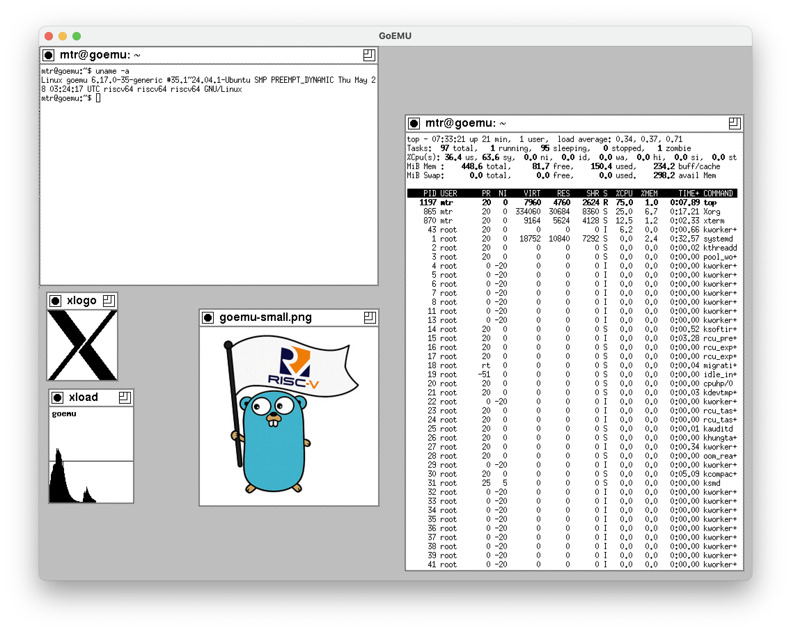

# RISC-V in Go

<p align="center">
  
</p>

<p align="center">
RV64GC RISC-V emulator written in Go capable of booting Linux, NetBSD,
FreeBSD, and OpenBSD through OpenSBI, U-Boot, EFI, and GRUB, with SV39
virtual memory and VirtIO devices.
</p>

<p align="center">
OpenSBI &#8594; BuildRoot Linux<br>
OpenSBI &#8594; U-Boot &#8594; EFI &#8594; {NetBSD,FreeBSD,OpenBSD}<br>
OpenSBI &#8594; U-Boot &#8594; EFI &#8594; GRUB &#8594; Ubuntu Linux
</p>

## Features

- RV64GC instruction set support
- Machine, Supervisor, and User privilege modes
- SV39 virtual memory and page tables with TLB fastpaths
- Custom Device Tree generation for hardware peripherals
- OpenSBI support
- VirtIO support (block, net, rng, gpu) with stable multi-hour async
  DMA handling
- Operating Systems:
  - OpenSBI
  - U-Boot
  - EFI Boot
  - Buildroot Linux
  - Ubuntu 24.04 (tested with full package upgrade cycles)
  - NetBSD 11.99
  - FreeBSD 15.1
  - OpenBSD 7.9 (tested with kernel compilation inside guest)
- Linux syscall emulation mode
- Device emulation:
  - NS16550A UART
  - PLIC interrupt controller
  - ACLINT MSWI and MTIMER devices
  - Syscon poweroff device
- Symbol-aware traces and debugging support
- Instruction-level execution tracing
- Compressed instruction support

The project is intended as a readable and hackable implementation of a
modern RISC-V platform, suitable for learning emulator internals,
operating systems, and the RISC-V privileged architecture.




## TODO

### Release 1.0

- [x] VirtIO
  - [x] virtio-blk
  - [x] virtio-rng
  - [x] virtio-net
    - [x] fix NetBSD receive path
  - [x] virtio-gpu
- [ ] [riscv-arch-test](https://github.com/riscv/riscv-arch-test)

### MCP RISC-V

The project is divided into two tracks:

1. **CPU conformance**
    - A clean, pure Go implementation of the RISC-V processor.
    - Prioritize correctness, readability, and maintainability.
    - Apply performance optimizations where they do not compromise
      code quality.
    - This CPU implementation serves as the reference implementation
      and will later be reimplemented using MPC primitives to create a
      virtual MPC RISC-V CPU.

2. **System emulation**
    - Emulate the system surrounding the CPU, including memory,
      interrupts, and devices.
    - Use asynchronous device interfaces where appropriate.
    - Optimize this layer for performance.
    - In the MPC architecture, this layer remains outside the MPC
      computation and interacts with the virtual MPC CPU.

### System emulation and supervisor mode

- [ ] VirtIO
  - [ ] virtio-net
    - [ ] HTTP proxy
    - [ ] NTP server
    - [ ] Async send path
  - [ ] virtio-blk
    - [ ] Async I/O
  - [ ] virtio-console
- [ ] SMP support
- [ ] Parse Linux kernel PE32+ header: load address, symbols
- [ ] JIT experiments

### Userspace emulation

- [ ] Full Linux userspace compatibility

## Quick start

Clone and run:

```shell
$ git clone https://github.com/markkurossi/riscv
$ cd riscv/cmd/goemu
$ go build
$ ./goemu buildroot.goemu
```

Expected output:

``` shell
OpenSBI v1.6

[    0.000000] Booting Linux on hartid 0
[    0.000000] Linux version 7.0.11 (root@5c73f8dabee1) (riscv64-linux-gnu-gcc (Ubuntu 13.3.0-6ubuntu2~24.04.1) 13.3.0, GNU ld (GNU Binutils for Ubuntu) 2.42) #9 SMP PREEMPT Wed Jun  3 08:23:43 UTC 2026
[    0.000000] Machine model: goemu,riscv-emulator
...
[   12.291753] Freeing initrd memory: 9468K
[   18.570200] clk: Disabling unused clocks
[   18.570327] PM: genpd: Disabling unused power domains
[   18.570487] ALSA device list:
[   18.570595]   No soundcards found.
[   18.582016] Freeing unused kernel image (initmem) memory: 2428K
[   18.582810] Run /init as init process
...
Welcome to GoEMU RISC-V Linux

Kernel: 7.0.11
Machine: riscv64

buildroot login: root
login[79]: root login on 'console'
# ls -la
total 4
drwx------    2 root     root            60 Apr 19 05:25 .
drwxr-xr-x   18 root     root           420 May 18 05:41 ..
-rw-------    1 root     root           192 Apr 19 05:25 .ash_history
# uname -a
Linux goemu 7.0.11 #9 SMP PREEMPT Wed Jun  3 08:23:43 UTC 2026 riscv64 GNU/Linux
# date
Mon Jun  8 04:55:00 UTC 2026
# halt
...
The system is going down NOW!
Sent SIGTERM to all processes
Sent SIGKILL to all processes
Requesting system halt
[   22.943205] reboot: System halted
```

The `buildroot.goemu` file defines the emulator BIOS, kernel, and
rootfs arguments. Those arguments can also be specified (and
overwritten) with corresponding command line arguments:

``` shell
$ ./goemu -bios opensbi/fw_jump.bin \
          -kernel linux-7.0.11/Image \
          -symbols linux-7.0.11/System.map \
          -drive id=hd0,format=raw,file=linux-2026-04-08/rootfs.ext2 \
          -device virtio-blk-device,drive=hd0 \
          -append "earlycon=sbi console=ttyS0,115200 root=/dev/vda ro rootwait"
```

The `cmd/goemu` directory contains `*.goemu` files for different
operation systems. The use OpenSBI and U-Boot for the boot process but
you must load the corresponding Operating System image to boot.

 - [BuildRoot](cmd/goemu/buildroot.goemu) - self-contained
 - [FreeBSD](cmd/goemu/freebsd.goemu) - download FreeBSD-15.1-RELEASE
   image
 - [NetBSD](cmd/goemu/netbsd.goemu) - download NetBSD 11.99 image
 - [Ubuntu-24.04](cmd/goemu/u-boot-ubuntu-24-04.goemu) - download
   Ubuntu-24.04.4 image

## Emulator Example

The `goemu` provides also a primitive Linux userspace emulation:

``` shell
$ cd cmd/goemu/
$ file examples/hello
examples/hello: ELF 64-bit LSB executable, UCB RISC-V, soft-float ABI, version 1 (SYSV), statically linked, not stripped
$ ./goemu -ktrace examples/hello
    0     0 CALL write(1,10050,15)
Hello, RISC-V!
    0     0 RET  write 15
    0     0 CALL exit(0)
```

## Architecture

```text
+--------------------+
| Linux / NetBSD /   |
| FreeBSD Userspace  |
+--------------------+
| Linux / NetBSD /   |
| FreeBSD Kernel     |
+--------------------+
| U-Boot / EFI       |
+--------------------+
| OpenSBI            |
+--------------------+
| RV64GC CPU         |
| SV39 MMU           |
| CSR subsystem      |
| Interrupts         |
+--------------------+
| VirtIO Block       |
| UART               |
| PLIC               |
| ACLINT             |
| Goldfish RTC       |
| Syscon Poweroff    |
+--------------------+
```

## Benchmarks

## Real Workloads

### OpenBSD 7.9

- Boot to console via OpenSBI → U-Boot → EFI
- Full native kernel compilation (`make build`) inside the guest environment
- Verified memory management stability under heavy parallel compiler runs

### NetBSD 11.99

- Boot to login prompt
- Compile Hello World with GCC
- Run user binaries
- Clean shutdown

Example:

``` shell
$ time cc -o hello hello.c
        4.20 real         2.62 user         1.00 sys
```

### Ubuntu 24.04 LTS

- Complete unattended system package upgrade (apt upgrade)
- Sustained high VirtIO disk and network I/O throughput over
  multi-hour runs

## Fibonacci

Performance improvements are tracked as the emulator evolves. The
numbers below show the effect of individual optimizations. They are
from running [fibo.c](tests/static/fibo.c) on:

``` text
cpu: Intel(R) Core(TM) i5-8257U CPU @ 1.40GHz
```

| Optimization        | fib 30 | fib 35 |    fib 40 |   MIPS | Total |   Incr |
|:--------------------|-------:|-------:|----------:|-------:|------:|-------:|
| Base                |  2.969 | 32.510 |           |  19.75 | 1.00x |     -- |
| GC-less decode      |  1.803 | 19.726 |           |  32.55 | 1.65x | +64.8% |
| PTE access checks   |  1.763 | 19.128 |           |  33.57 | 1.70x |  +3.1% |
| MMU Map fastpath    |  1.709 | 18.507 |           |  34.70 | 1.76x |  +3.4% |
| DecodeCFast         |  1.280 | 13.848 | 2m33.240s |  45.78 | 2.35x | +31.9% |
| Cached code page    |  0.977 | 10.582 | 1m57.654s |  60.68 | 3.07x | +32.5% |
| Concrete memory     |  0.915 |  9.835 | 1m48.920s |  65.29 | 3.31x |  +7.6% |
| 32-bit decode cache |  0.684 |  7.327 | 1m20.509s |  87.64 | 4.44x | +34.2% |
| Ld/Sd TLB fastpath  |  0.603 |  6.327 | 1m10.533s | 101.49 | 5.14x | +15.8% |
| Optimized Instr     |  0.385 |  4.022 | 0m44.167s | 159.65 | 8.08x | +57.3% |
| Interrupts          |  0.416 |  4.321 | 0m49.085s | 148.61 | 7.52x |  -6.9% |
| unsafe.Pointer¹     |  0.363 |  3.668 | 0m40.373s | 175.06 | 8.86x | +17.8% |
| unsafe.Add          |  0.358 |  3.582 | 0m39.659s | 179.27 | 9.08x |  +2.4% |

1. contains several optimizations:
  - instr decode cache by `pc>>2` instead of `raw>>2`
  - unsafe.Pointer PC load and uint64 `sd` and `ld`

# Appendix

## Userspace Emulation - MMU Refactoring

 - [x] Fix page table MMU code to run the existing samples
 - [ ] Refactor the entire emulator stack
   - [ ] CPU -> Kernel -> Process -> Emulator
   - [ ] Kernel creates processes 1-n
   - [ ] Virtual memory handled per process
   - [ ] CPU has only {Load,Store}Uint{8,16,32,64}()
   - [ ] Process has {Put,}Uint{8,16,32,64,String,Data}() functions
   - [ ] Syscall can cause page fault on mmap'ed files. Syscall's
         traps should fill page table.
 - [x] sfence.vma must clear MMU's TLB entries
 - [x] Remove `Raw uint32` from `Instr`?
 - [x] MMU with page tables
   - [ ] Move pagetable to processes
 - [ ] Refactor emulator source files
 - [ ] Rethink FD handling.
 - [ ] Run most Linux and Go binaries
 - [ ] Proper Linux syscall support

### Kernel memory map

``` text
+--------------------------------+
| 0xBFFF_FFFF                    |
~                                ~
| 0x8000_0000    System RAM      |
+--------------------------------+
| 0x1000_7FFF                    |
~                                ~
| 0x1000_1000    VirtIO Devices  |
+--------------------------------+
| 0x1000_00FF                    |
~                                ~
| 0x1000_0000    UART (NS16550A) |
+--------------------------------+
| 0x0FFF_FFFF                    |
~                                ~
| 0x0C00_0000    PLIC            |
+--------------------------------+
| 0x0200_FFFF                    |
~                                ~
| 0x0200_0000    CLINT           |
+--------------------------------+
| 0x0000_2FFF                    |
~                                ~
| 0x0000_1000    Boot ROM        |
+--------------------------------+
```

### System RAM

``` text
+--------------------------------+
|                                |
~                                ~
| 0x8800_0000    initrd          |
+--------------------------------+
|                                |
~                                ~
| 0x8400_0000    hw.dtb          |
+--------------------------------+
|                                |
~                                ~
| 0x8020_0000    Image           |
+--------------------------------+
|                                |
~                                ~
| 0x8000_0000    fw_boot.bin     |
+--------------------------------+

```
# OpenSBI and Das U-Boot

## u-boot

``` shell
$ apt-get update && apt-get install -y libssl-dev
$ apt-get update && apt-get install -y libgnutls28-dev uuid-dev
```

``` shell
$ cd u-boot-2026.04/
$ export CROSS_COMPILE=riscv64-linux-gnu-
$ ls configs/ | grep riscv
openpiton_riscv64_defconfig
openpiton_riscv64_spl_defconfig
qemu-riscv64_defconfig
qemu-riscv64_smode_acpi_defconfig
qemu-riscv64_smode_defconfig
qemu-riscv64_spl_defconfig
$ make qemu-riscv64_smode_defconfig
  HOSTCC  scripts/basic/fixdep
  HOSTCC  scripts/kconfig/conf.o
  YACC    scripts/kconfig/zconf.tab.[ch]
  LEX     scripts/kconfig/zconf.lex.c
  HOSTCC  scripts/kconfig/zconf.tab.o
  HOSTLD  scripts/kconfig/conf
#
# configuration written to .config
#
$ make -j$(nproc)
```

## Network routing

On macOS host:

``` shell
$ sudo sysctl -w net.inet.ip.forwarding=1
```

Create `pf.conf`

``` txt
nat on en0 from 192.168.42.0/24 to any -> (en0)
```

Load conf:

``` shell
$ sudo pfctl -f pf.conf
$ sudo pfctl -e
```

# FreeBSD

## ports

``` shell
$ tar -xf ports-main.tar.gz -C /usr
$ mv /usr/ports-main /usr/ports
$ cd /usr/ports/x11/xorg
$ make install clean
```

## Compiling git

### Compile curl

``` shell
$ ./configure --with-openssl --without-libpsl
```

### Compile git

The `-O0` is needed to prevent clang compiler error:

``` shell
CC sha1dc/sha1.o

error: ran out of registers during register allocation

1 error generated.
```

``` shell
$ ./configure --with-curl=/usr/local
$ gmake NO_RUST=1 CFLAGS="-O0 -I/usr/local/include" LDFLAGS="-L/usr/local/lib -liconv"
```

## Expanding image

Host:

``` shell
$ truncate -s +1G FreeBSD-15.1-RELEASE-riscv-riscv64-GENERICSD.img
```

Guest:

``` shell
# gpart recover vtbd0
# gpart resize -i 4 vtbd0
# growfs /
```

# Ubuntu

Check how to disable systemd. It is using +35% CPU if host network is
down.

## Grow Image

Host:

``` shell
# Add 5 GB to the image
$ truncate -s +5G rootfs.img
```

Guest:

``` shell
$ df -h
$ lsblk -f
$ sudo growpart /dev/vda 1
$ sudo resize2fs /dev/vda1
```

# Conformance tests

``` shell
$ ./goemu -cooked -htif -kernel ../../testdata/isa/rv64mi-p-illegal
```

fails on

``` asm
bad6:
  # Make sure SFENCE.VMA and satp do trap when TVM=1.
  sfence.vma
  j fail
bad7:
  csrr t0, satp
  j fail

000000008000036c <bad6>:
    8000036c:	12000073          	sfence.vma
    80000370:	0700006f          	j	800003e0 <fail>

```
