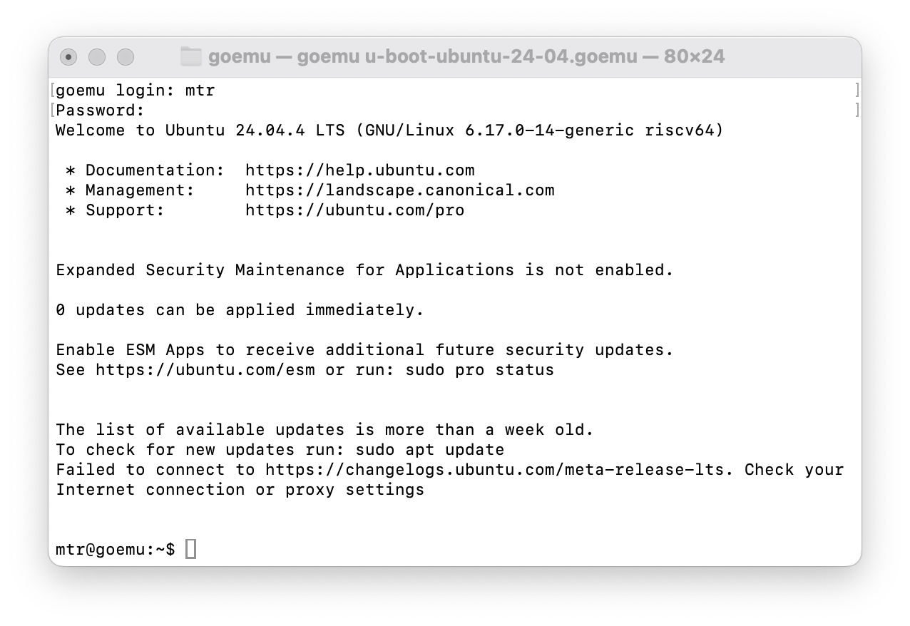

# RISC-V in Go

<p align="center">
  
</p>

<p align="center">
Linux-capable RV64GC RISC-V emulator written in Go with SV39 virtual
memory, privilege modes, and device emulation.
</p>

## Features

- RV64GC instruction set support
- Machine, Supervisor, and User privilege modes
- SV39 virtual memory and page tables
- OpenSBI support
- VirtIO block storage support
- Linux kernel boot support (Ubuntu-24.04, Buildroot)
- Linux syscall emulation mode
- Device emulation:
  - NS16550A UART
  - PLIC interrupt controller
  - ACLINT MSWI and MTIMER devices
  - Syscon poweroff device
- Symbol-aware traces and debugging support
- Instruction-level execution tracing
- Compressed instruction support

The project is intended as a readable and hackable implementation of a
modern RISC-V platform, suitable for learning emulator internals,
operating systems, and the RISC-V privileged architecture.

## Current status

The emulator now boots OpenSBI and Linux 7.x to a functional
Ubuntu24.04.4 shell. The machine supports privilege transitions,
virtual memory, interrupts, timer devices, and enough platform
hardware to run a Linux userspace environment.



### Userspace emulation

- [x] Standalone binaries
- [x] Statically linked binaries
- [x] Dynamically linked binaries
- [x] Basic Go binaries
- [ ] Full Linux userspace compatibility

### Linux system emulation

- [x] OpenSBI boot
- [x] Device Tree support
- [x] Machine/Supervisor/User privilege modes
- [x] SV39 MMU
- [x] Interrupt handling
- [x] ACLINT timer/IPI support
- [x] PLIC interrupt controller
- [ ] Parse kernel PE32+ header: load address, symbols
- [ ] VirtIO
  - [x] virtio-blk
- [x] Initramfs loading
- [x] Buildroot shell login
- [x] System shutdown support
- [ ] SMP support
- [ ] [riscv-arch-test](https://github.com/riscv/riscv-arch-test)

## Quick start

Clone and run:

```shell
$ git clone https://github.com/markkurossi/riscv
$ cd riscv/cmd/goemu
$ go build
$ ./goemu buildroot.goemu
```

Expected output:

``` shell
OpenSBI v1.6

[    0.000000] Booting Linux on hartid 0
[    0.000000] Linux version 7.0.11 (root@5c73f8dabee1) (riscv64-linux-gnu-gcc (Ubuntu 13.3.0-6ubuntu2~24.04.1) 13.3.0, GNU ld (GNU Binutils for Ubuntu) 2.42) #9 SMP PREEMPT Wed Jun  3 08:23:43 UTC 2026
[    0.000000] Machine model: goemu,riscv-emulator
...
[   12.291753] Freeing initrd memory: 9468K
[   18.570200] clk: Disabling unused clocks
[   18.570327] PM: genpd: Disabling unused power domains
[   18.570487] ALSA device list:
[   18.570595]   No soundcards found.
[   18.582016] Freeing unused kernel image (initmem) memory: 2428K
[   18.582810] Run /init as init process
...
Welcome to GoEMU RISC-V Linux

Kernel: 7.0.11
Machine: riscv64

buildroot login: root
login[79]: root login on 'console'
# ls -la
total 4
drwx------    2 root     root            60 Apr 19 05:25 .
drwxr-xr-x   18 root     root           420 May 18 05:41 ..
-rw-------    1 root     root           192 Apr 19 05:25 .ash_history
# uname -a
Linux goemu 7.0.11 #9 SMP PREEMPT Wed Jun  3 08:23:43 UTC 2026 riscv64 GNU/Linux
# date
Mon Jun  8 04:55:00 UTC 2026
# halt
...
The system is going down NOW!
Sent SIGTERM to all processes
Sent SIGKILL to all processes
Requesting system halt
[   22.943205] reboot: System halted
```

The `buildroot.goemu` file defines the emulator BIOS, kernel, and
rootfs arguments. Those arguments can also be specified (and
overwritten) with corresponding command line arguments:

``` shell
$ ./goemu -bios opensbi/fw_jump.bin \
          -kernel linux-7.0.11/Image \
          -symbols linux-7.0.11/System.map \
          -drive id=hd0,format=raw,file=linux-2026-04-08/rootfs.ext2 \
          -device virtio-blk-device,drive=hd0 \
          -append "earlycon=sbi console=ttyS0,115200 root=/dev/vda ro rootwait"
```

## Emulator Example

The `goemu` provides also a primitive Linux userspace emulation:

``` shell
$ cd cmd/goemu/
$ file examples/hello
examples/hello: ELF 64-bit LSB executable, UCB RISC-V, soft-float ABI, version 1 (SYSV), statically linked, not stripped
$ ./goemu -ktrace examples/hello
    0     0 CALL write(1,10050,15)
Hello, RISC-V!
    0     0 RET  write 15
    0     0 CALL exit(0)
```

## Architecture

```text
+--------------------+
| Linux / Userspace  |
+--------------------+
| OpenSBI            |
+--------------------+
| Emulator Core      |
|  - RV64GC CPU      |
|  - MMU (SV39)      |
|  - CSR subsystem   |
|  - Trap handling   |
+--------------------+
| Devices            |
| UART               |
| PLIC               |
| ACLINT             |
| Syscon             |
+--------------------+
```

## Benchmarks

Performance improvements are tracked as the emulator evolves. The
numbers below show the effect of individual optimizations. They are
from running [fibo.c](tests/static/fibo.c) on:

``` text
cpu: Intel(R) Core(TM) i5-8257U CPU @ 1.40GHz
```

| Optimization             |   MIPS |
|:-------------------------|-------:|
| Base                     |  19.75 |
| GC-less decode           |  32.55 |
| PTE access checks        |  33.57 |
| MMU Map fastpath         |  34.70 |
| DecodeCFast              |  45.78 |
| Cached code page         |  60.68 |
| Concrete memory          |  65.29 |
| 32-bit decode cache      |  87.64 |
| Ld/Sd TLB fastpath       | 101.49 |
| Optimized Instr struct   | 159.65 |
| Added interrupt handling | 147.38 |


# Development roadmap

## Near term

 - [x] UART interrupt wiring in DTB
 - [x] Host terminal polling
 - [x] Proper wfi sleep behavior
 - [x] Add VirtIO block device (virtio-blk)
 - [ ] Add VirtIO networking
 - [ ] Process-local page tables in emulator mode
 - [ ] Full syscall coverage in emulator mode

## Longer term

 - [ ] SMP support
 - [ ] Additional VirtIO devices
 - [ ] Additional ISA extensions
 - [ ] JIT experiments
 - [ ] Performance optimizations

# Appendix

## Benchmark history

| Optimization           | fib 30 | fib 35 |    fib 40 |   MIPS | Relative |
|:-----------------------|-------:|-------:|----------:|-------:|---------:|
| Base                   |  2.969 | 32.510 |           |  19.75 |    1.000 |
| GC-less decode         |  1.803 | 19.726 |           |  32.55 |    0.607 |
| PTE access checks      |  1.763 | 19.128 |           |  33.57 |    0.588 |
| MMU Map fastpath       |  1.709 | 18.507 |           |  34.70 |    0.569 |
| DecodeCFast            |  1.280 | 13.848 | 2m33.240s |  45.78 |    0.426 |
| Cached code page       |  0.977 | 10.582 | 1m57.654s |  60.68 |    0.325 |
| Concrete memory        |  0.915 |  9.835 | 1m48.920s |  65.29 |    0.303 |
| 32-bit decode cache    |  0.684 |  7.327 | 1m20.509s |  87.64 |    0.225 |
| Ld/Sd TLB fastpath     |  0.603 |  6.327 | 1m10.533s | 101.49 |    0.195 |
| Optimized Instr struct |  0.385 |  4.022 | 0m44.167s | 159.65 |    0.124 |
| Interrupts             |  0.416 |  4.321 | 0m49.085s | 148.61 |    0.134 |

## Internal roadmap

 - [ ] Does Image have a PE header? Does it also contain System.map?

## MMU Refactoring

 - [x] Fix page table MMU code to run the existing samples
 - [ ] Refactor the entire emulator stack
   - [ ] CPU -> Kernel -> Process -> Emulator
   - [ ] Kernel creates processes 1-n
   - [ ] Virtual memory handled per process
   - [ ] CPU has only {Load,Store}Uint{8,16,32,64}()
   - [ ] Process has {Put,}Uint{8,16,32,64,String,Data}() functions
   - [ ] Syscall can cause page fault on mmap'ed files. Syscall's
         traps should fill page table.
 - [x] sfence.vma must clear MMU's TLB entries
 - [x] Remove `Raw uint32` from `Instr`?

## Step 2 - MMU and Linux syscalls

 - [x] MMU with page tables
   - [ ] Move pagetable to processes
 - [ ] Refactor emulator source files
 - [ ] Rethink FD handling.
 - [ ] Run most Linux and Go binaries
 - [ ] Proper Linux syscall support

## Step 3 - Supervisor mode

 - [x] Supervisor mode
 - [x] Boot Linux kernel

### Kernel memory map

``` text
+--------------------------------+
| 0xBFFF_FFFF                    |
~                                ~
| 0x8000_0000    System RAM      |
+--------------------------------+
| 0x1000_7FFF                    |
~                                ~
| 0x1000_1000    VirtIO Devices  |
+--------------------------------+
| 0x1000_00FF                    |
~                                ~
| 0x1000_0000    UART (NS16550A) |
+--------------------------------+
| 0x0FFF_FFFF                    |
~                                ~
| 0x0C00_0000    PLIC            |
+--------------------------------+
| 0x0200_FFFF                    |
~                                ~
| 0x0200_0000    CLINT           |
+--------------------------------+
| 0x0000_2FFF                    |
~                                ~
| 0x0000_1000    Boot ROM        |
+--------------------------------+
```

### System RAM

``` text
+--------------------------------+
|                                |
~                                ~
| 0x8800_0000    initrd          |
+--------------------------------+
|                                |
~                                ~
| 0x8400_0000    hw.dtb          |
+--------------------------------+
|                                |
~                                ~
| 0x8020_0000    Image           |
+--------------------------------+
|                                |
~                                ~
| 0x8000_0000    fw_boot.bin     |
+--------------------------------+

```
# OpenSBI and Das U-Boot

## u-boot

``` shell
$ apt-get update && apt-get install -y libssl-dev
$ apt-get update && apt-get install -y libgnutls28-dev uuid-dev
```

``` shell
$ cd u-boot-2026.04/
$ export CROSS_COMPILE=riscv64-linux-gnu-
$ ls configs/ | grep riscv
openpiton_riscv64_defconfig
openpiton_riscv64_spl_defconfig
qemu-riscv64_defconfig
qemu-riscv64_smode_acpi_defconfig
qemu-riscv64_smode_defconfig
qemu-riscv64_spl_defconfig
$ make qemu-riscv64_smode_defconfig
  HOSTCC  scripts/basic/fixdep
  HOSTCC  scripts/kconfig/conf.o
  YACC    scripts/kconfig/zconf.tab.[ch]
  LEX     scripts/kconfig/zconf.lex.c
  HOSTCC  scripts/kconfig/zconf.tab.o
  HOSTLD  scripts/kconfig/conf
#
# configuration written to .config
#
$ make -j$(nproc)
```

# NetBSD

``` shell
$ ./goemu netbsd.goemu
<RET>
fatload virtio 0:1 0x84000000 /EFI/BOOT/BOOTRISCV64.EFI
setenv bootargs "boot hd0a:netbsd -v -s consdev=com0 speed=115200"
bootefi 0x84000000 0x9eeae220
```

debugging in u-boot:

``` shell
=> part list virtio 0
```

## Bugs

[   1.0000030] WARNING: system needs entropy for security; see entropy(7)
Waiting for entropy...[   7.4499016] entropy: pid 445 (dd) waiting for entropy(7)

  000393f4:  4ae4744b   Instr: Op=invalid      # decode failed: group NMSUB not implemented yet: raw=4ae4744b
3ff86b2006:  62b775cb   Instr: Op=invalid      # decode failed: group NMSUB not implemented yet: raw=62b775cb

# FreeBSD

## Bugs

142e9ec1de:  42f6f6cb   Instr: Op=invalid      # decode failed: group NMSUB not implemented yet: raw=42f6f6cb
